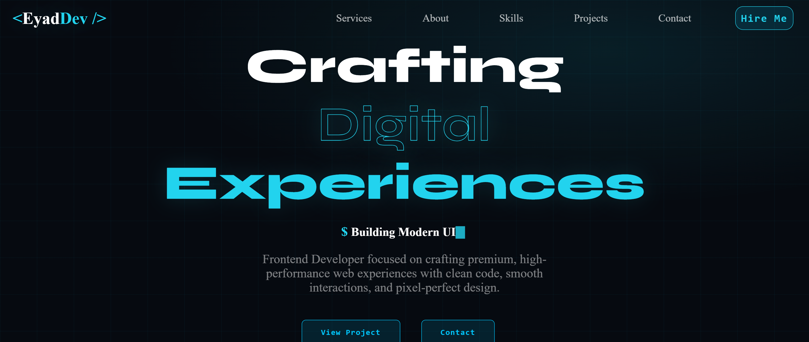

# EyadDev — Personal Developer Portfolio

A dark, cyberpunk-inspired personal portfolio built with React and TypeScript — designed to showcase projects, skills, and services with smooth scroll-reveal animations throughout.

**Live Demo:** Coming Soon · Built with React, TypeScript & Vite

## ✨ Overview

EyadDev is a single-page personal portfolio for a frontend developer, presenting an intro, services, about section, skills, featured projects, and a fully functional contact form. The project focuses on clean component architecture, reusable UI pieces (like a scroll-reveal wrapper used across every section), and a fast, responsive experience built on Vite.

## 🖼️ Preview

| Hero | Services |
|------|----------|
|  |  |
| About | Projects |
|-------|----------|
|  |  |
| Contact |
|---------|
|  |
## 🚀 Features

- **Typewriter Hero** — animated role text that types and deletes through a list of titles
- **Scroll-Reveal Animations** — a reusable `FadeUp` component (built on `IntersectionObserver`) fades sections into view as the user scrolls
- **Services Section** — highlights core offerings (business websites, landing pages, e-commerce frontends, admin dashboards)
- **About Section** — bio, profile image, and quick stats (experience, projects built, clients)
- **Skills Showcase** — tech stack presented as cards
- **Projects Showcase** — featured project cards with live demo and GitHub links
- **Functional Contact Form** — built with React Hook Form and Zod validation, submitting real messages via Web3Forms
- **Responsive Header** — nav bar that changes appearance on scroll, with a mobile hamburger menu

## 🛠️ Tech Stack

- React + TypeScript — typed components and props
- Vite — build tooling and dev server
- React Hook Form + Zod — form state and schema validation
- Web3Forms — contact form submission (no backend required)
- Lucide React / React Icons — iconography

## 🧩 Notable Technical Details

- Custom `FadeUp` wrapper component using `IntersectionObserver` to trigger scroll-based reveal animations, reused across every section instead of duplicating animation logic
- Typewriter effect implemented from scratch with `useState`/`useEffect` (typing and deleting through a rotating list of role titles)
- Contact form validated with a Zod schema and wired to Web3Forms for real email delivery, with inline error messages per field
- Component structure split by section (Hero, Services, About, Tech, Projects, GetInTouch, Header, Footer) for clarity and easy navigation

## 📂 Project Structure

```
src/
├── Components/
│   ├── AboutMe/         # AboutMe, AboutContent, AboutStats, AboutBoxImg
│   ├── Footer/           # Footer
│   ├── GetInTouch/       # Contact, GetInTouchForm, GetInTouchSchema
│   ├── Header/           # Header, HeaderNav, HamburgerNav
│   ├── Hero/              # Hero, typewriter role animation, Herobutton
│   ├── Logo/              # Logo
│   ├── Projects/         # Projects, ProjectsCards
│   ├── Services/         # Services
│   ├── Tech/               # TechSkills, TechSkillsCard, TechSkillsMainHeading
│   ├── styles/             # Scoped CSS design system
│   └── FadeUp.tsx        # Reusable scroll-reveal wrapper
├── App.tsx
└── main.tsx
```

## 🏃 Running Locally

```bash
git clone https://github.com/eyads2kr/Eyad-portfolio.git
cd Eyad-portfolio
npm install
npm run dev
```

## 📌 Roadmap

- [ ] Deploy and add a live demo link
- [ ] Add project screenshots to this README
- [ ] Add a blog / articles section
- [ ] Improve accessibility (alt text, keyboard navigation)

## 👤 Author

**Eyad Sakr** — Frontend Developer — React / TypeScript

GitHub: [github.com/Eyad-sakr](https://github.com/Eyad-sakr) · LinkedIn: [eyad-sakr](https://www.linkedin.com/in/eyad-sakr-b21375318)

---

This is a personal portfolio project built to demonstrate frontend development skills.
